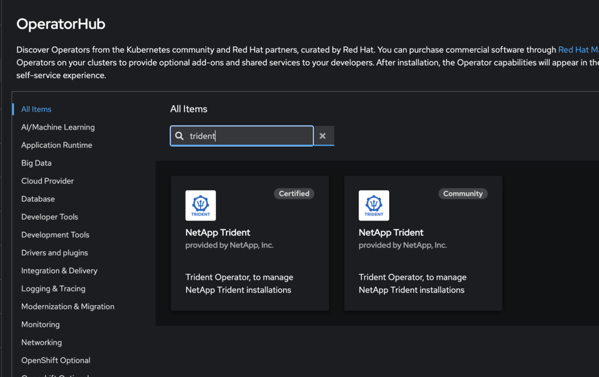

= Passare dall'operatore della comunità Trident all'operatore certificato OpenShift
:hardbreaks:
:allow-uri-read: 
:icons: font
:imagesdir: ../media/

[role="lead"]
Per passare dall'operatore Trident della comunità di NetApp all'operatore Trident certificato di Red Hat OpenShift, è necessario disinstallare l'operatore della comunità e quindi installare l'operatore certificato utilizzando l'OperatorHub.

.Prima di iniziare
Prima di iniziare l'installazione, link:../trident-get-started/requirements.html["Preparare l'ambiente per l'installazione di Trident"].

== Disinstallare l'operatore della comunità NetApp Trident

.Fasi
. Utilizzare la console OpenShift per passare all'OperatorHub.
+

. Trova l'operatore della community NetApp Trident.
+
image::../media/openshift-operator-06.png[Installato]

+

WARNING: Non selezionare *Elimina tutte le istanze dell'operando da questo operatore*.

. Fare clic su *Disinstalla*.

== Installare l'operatore certificato OpenShift

.Fasi
. Accedere a Red Hat OperatorHub.
. Cercare e selezionare l'operatore NetApp Trident.
+

. Seguire le istruzioni visualizzate sullo schermo per installare l'operatore.

== Verifica

* Controllare l'OperatorHub nella console per assicurarsi che il nuovo operatore certificato sia stato installato correttamente.

