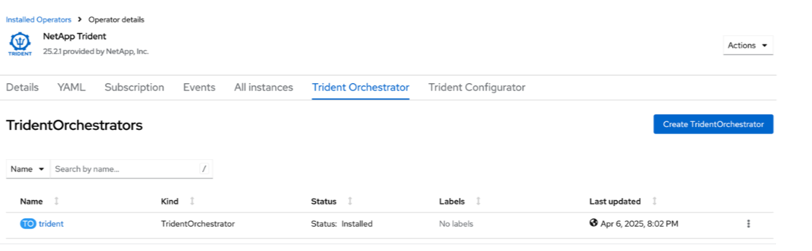

= Installare Trident utilizzando OpenShift OperatorHub
:hardbreaks:
:allow-uri-read: 
:icons: font
:imagesdir: ../media/

[role="lead"]
Se usate Red Hat OpenShift, potete installare NetApp Trident usando l'operatore certificato Red Hat. Utilizzate questa procedura per installare Trident dalla piattaforma contenitore di Red Hat OpenShift.

.Prima di iniziare
Prima di iniziare l'installazione, link:../trident-get-started/requirements.html["Preparare l'ambiente per l'installazione di Trident"].

== Individuare e installare l'operatore Trident

.Fasi
. Accedere a OpenShift OperatorHub e cercare NetApp Trident.
+
image::../media/openshift-operator-01.png[Operatore Trident]

. Fare clic su * NetApp Trident* per aprire le impostazioni di installazione.
. Selezionare le opzioni richieste e fare clic su *Installa* per aprire la configurazione dell'operatore.
+
image::../media/openshift-operator-02.png[Installare]

+

NOTE: Assicurati di selezionare la versione più recente dell'operatore.

. Mantieni tutti i parametri così come sono e fai clic su *Installa*.
+
image::../media/openshift-operator-03.png[Installare]

+
Una volta completata l'installazione, l'Operatore sarà visibile nell'elenco degli operatori installati e sarà pronto per essere utilizzato.

. Fare clic su *Visualizza operatore* per visualizzare i dettagli dell'operatore.
+
image::../media/openshift-operator-04.png[Installato]

. In * Trident Orchestrator*, fare clic su *Crea istanza*.
+
image::../media/openshift-operator-07.png[Installato]

. Fare clic su *Visualizzazione YAML* e incollare quanto segue nel modulo:
+
[source, yaml]
----
apiVersion: trident.netapp.io/v1
kind: TridentOrchestrator
metadata:
  name: trident
  namespace: openshift-operators
spec:
  IPv6: false
  debug: false
  nodePrep:
  - iscsi
  imageRegistry: ''
  k8sTimeout: 30
  namespace: trident
  silenceAutosupport: false
----
+
[]
====
** Red Hat Enterprise Linux CoreOS (RHCOS) non ha iSCSI abilitato e configurato.
** Puoi aggiungere il `nodePrep` parametro per configurare e abilitare i servizi iSCSI e Multipath su tutti i nodi worker OpenShift.
** A partire da OpenShift 4.19, la versione minima Trident supportata per questa funzionalità è 25.06.1.

====
. Fare clic su *Crea*; Trident Orchestrator verrà installato completamente.
+

== Disinstallare l'operatore Trident

.Fasi
. Selezionare l'operatore Trident dall'elenco degli operatori installati.
. Selezionare se si desidera eliminare tutte le istanze dell'operando dall'operatore.
+

WARNING: Se non si seleziona la casella di controllo *Elimina tutte le istanze dell'operando da questo operatore*, Trident non verrà disinstallato.

. Fare clic su *Disinstalla*.

