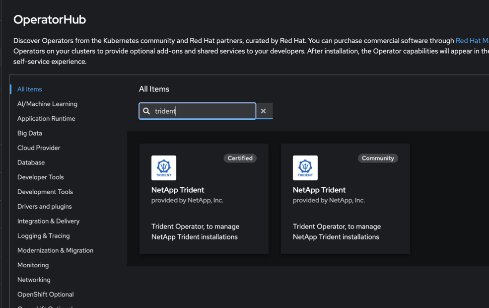

= Installare Trident utilizzando OpenShift OperatorHub
:hardbreaks:
:allow-uri-read: 
:icons: font
:imagesdir: ../media/

[role="lead"]
Se usate Red Hat OpenShift, potete installare NetApp Trident usando l'operatore certificato Red Hat. Utilizzate questa procedura per installare Trident dalla piattaforma contenitore di Red Hat OpenShift.

.Prima di iniziare
Prima di iniziare l'installazione, link:../trident-get-started/requirements.html["Preparare l'ambiente per l'installazione di Trident"].

== Individuare e installare l'operatore Trident

.Fasi
. Accedere a OpenShift OperatorHub e cercare NetApp Trident.
+
image::../media/openshift-operator-01.png[Operatore Trident]

. Fare clic su *Installa*.
+
image::../media/openshift-operator-02.png[Installare]

. Selezionare le opzioni richieste e fare clic su *Installa*.
+
image::../media/openshift-operator-03.png[Installare]

. Una volta completata l'installazione, l'operatore è visibile nell'elenco degli operatori installati.
+
image::../media/openshift-operator-04.png[Installato]

. Creare una TORC come l'installazione del bundle operatore.

== Disinstallare l'operatore Trident

.Fasi
. Selezionare l'operatore Trident dall'elenco degli operatori installati.
+

. Selezionare se si desidera eliminare tutte le istanze dell'operando dall'operatore.
+
image::../media/openshift-operator-06.png[Installato]

+

WARNING: Se non si seleziona la casella di controllo *Elimina tutte le istanze dell'operando da questo operatore*, Trident non verrà disinstallato.

. Fare clic su *Disinstalla*.

