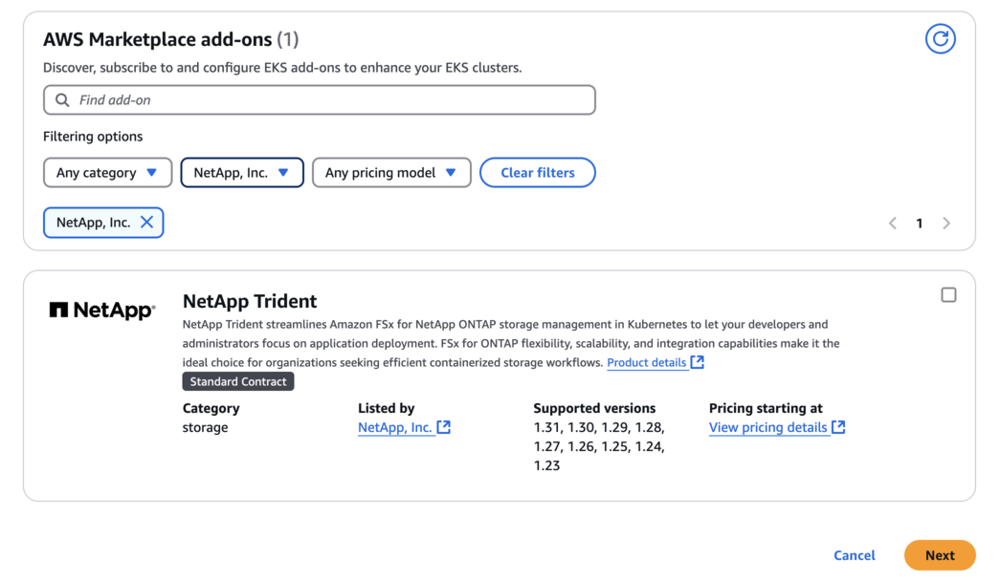

= Configurare il componente aggiuntivo Astra Trident EKS su un cluster EKS
:hardbreaks:
:allow-uri-read: 
:icons: font
:imagesdir: ../media/

[role="lead"]
Trident ottimizza la gestione dello storage di Amazon FSX per NetApp ONTAP in Kubernetes per permettere a sviluppatori e amministratori di concentrarsi sull'implementazione dell'applicazione. Il componente aggiuntivo Trident EKS include le più recenti patch di sicurezza, correzioni di bug ed è convalidato da AWS per funzionare con Amazon EKS. Il componente aggiuntivo EKS ti consente di garantire in modo coerente che i tuoi cluster Amazon EKS siano sicuri e stabili e di ridurre la quantità di lavoro da svolgere per installare, configurare e aggiornare i componenti aggiuntivi.

== Prerequisiti

Prima di configurare il componente aggiuntivo Trident per AWS EKS, assicurati di disporre di quanto segue:

* Un account cluster Amazon EKS con abbonamento add-on
* Autorizzazioni AWS nel marketplace AWS:
`"aws-marketplace:ViewSubscriptions",
"aws-marketplace:Subscribe",
"aws-marketplace:Unsubscribe`
* Tipo di ami: Amazon Linux 2 (AL2_x86_64) o Amazon Linux 2 Arm (AL2_ARM_64)
* Tipo di nodo: AMD o ARM
* Un file system Amazon FSX per NetApp ONTAP esistente

== Fasi

. Sul tuo cluster EKS Kubernetes, accedi alla scheda *Add-on*.
+
image::../media/aws-eks-01.png[aws eks 01]

. Vai su *componenti aggiuntivi di AWS Marketplace* e scegli la categoria _storage_.
+

. Individuare *NetApp Trident* e selezionare la casella di controllo per il componente aggiuntivo Trident.
. Scegliere la versione desiderata del componente aggiuntivo.
+
image::../media/aws-eks-03.png[aws eks 03]

. Selezionare l'opzione ruolo IAM per ereditare dal nodo.
+
image::../media/aws-eks-04.png[aws eks 04]

. Espandere le *Impostazioni di configurazione opzionali*, seguire lo schema di configurazione del componente aggiuntivo* e impostare il parametro configurationValues nella sezione *valori di configurazione* sul ruolo-arn creato nel passaggio precedente (il valore deve essere nel seguente formato: `eks.amazonaws.com/role-arn: arn:aws:iam::464262061435:role/AmazonEKS_FSXN_CSI_DriverRole`). Se si seleziona Sovrascrivi per il metodo di risoluzione dei conflitti, una o più impostazioni per il componente aggiuntivo esistente possono essere sovrascritte con le impostazioni del componente aggiuntivo Amazon EKS. Se non si attiva questa opzione e si verifica un conflitto con le impostazioni esistenti, l'operazione non riesce. È possibile utilizzare il messaggio di errore risultante per risolvere il conflitto. Prima di selezionare questa opzione, assicurati che il componente aggiuntivo Amazon EKS non gestisca le impostazioni da gestire in autonomia.
+
image::../media/aws-eks-06.png[aws eks 06]

. Selezionare *Crea*.
. Verificare che lo stato del componente aggiuntivo sia _attivo_.
+
image::../media/aws-eks-05.png[aws eks 05]

== Installare/disinstallare il componente aggiuntivo Trident EKS utilizzando la CLI

.Installare il componente aggiuntivo Trident EKS utilizzando la CLI:
Il seguente comando di esempio installa il componente aggiuntivo Trident EKS:
`eksctl create addon --cluster K8s-arm --name netapp_trident-operator --version v24.10.0-eksbuild`
`eksctl create addon --cluster clusterName --name netapp_trident-operator --version v24.10.0-eksbuild.1` (Con una versione dedicata)

.Disinstallare il componente aggiuntivo Trident EKS utilizzando CLI:
Il seguente comando disinstalla il componente aggiuntivo Trident EKS:
`eksctl delete addon --cluster K8s-arm --name netapp_trident-operator`
